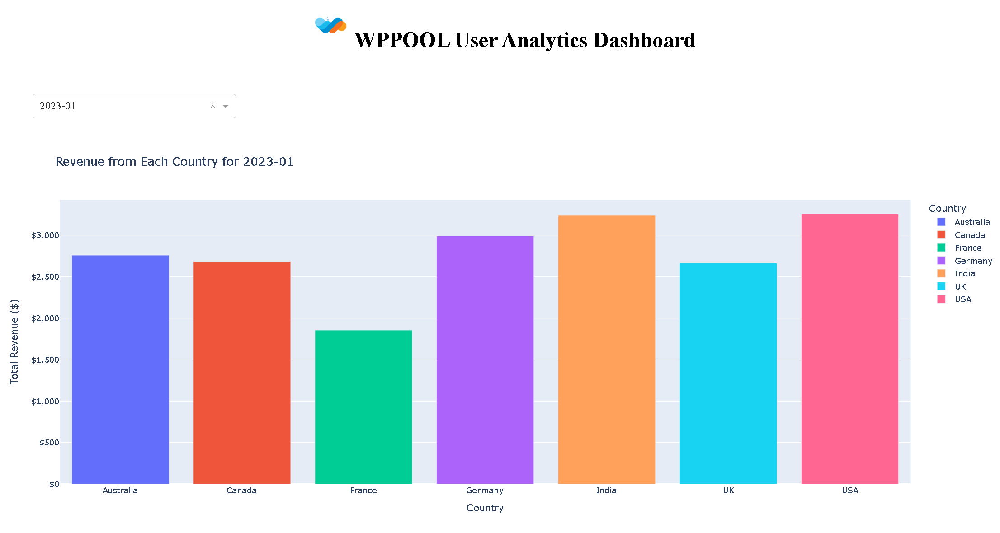
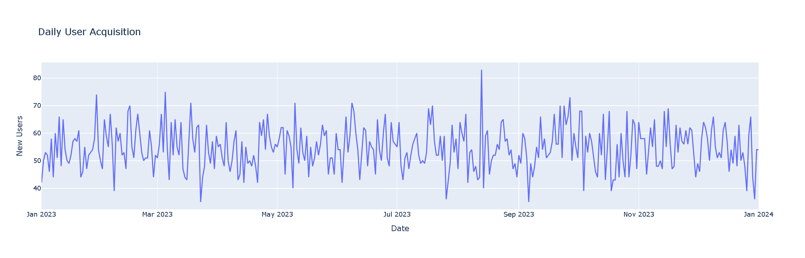
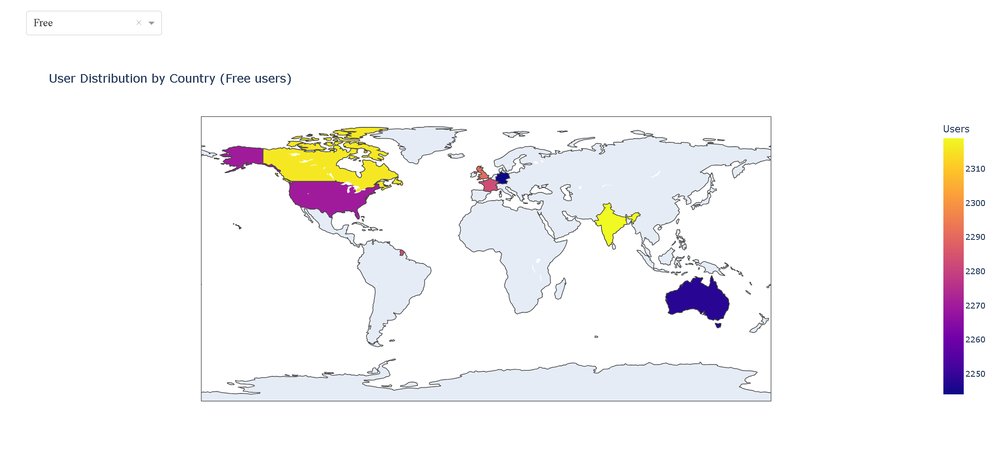
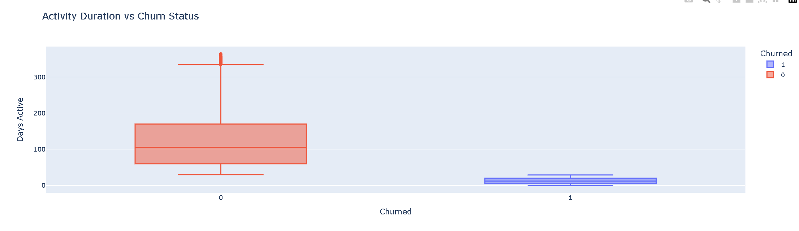

# Exploratory Data Analysis (EDA) and An Interective Dashboard Application

## 📌 Project Overview
In this project, I analyzed a dataset of `20,000` rows and `14` columns of WPPOOL and tried to answer some questions about them. This project focuses on **Exploratory Data Analysis (EDA)** to uncover patterns, detect anomalies, test hypotheses, and summarize key insights from the dataset. The analysis includes data cleaning, visualization, and statistical summarization to facilitate better decision-making. Additionally, a **dashboard application** was developed using **Plotly and Dash** and deployed on **Render**. Here is the link to the dashboard: [WPPOOL Growth Data Analysis Dashboard](https://wppool-growth-data-analysis.onrender.com/).

## 📂 Project Structure
```
📁 Project Folder
│── 📁 Data/          # Raw and processed data files
│── 📁 assets/        # Static files for dashboard
│── 📁 dashboard/     # Auto-generated dashboard files
│── 📄 EDA.ipynb       # Jupyter Notebook with code and analysis
│── 📄 License         # Project license
│── 📄 README.md       # Project documentation (this file)
│── 📄 app.py          # Dashboard application using Plotly and Dash
│── 📄 requirements.txt # Dependencies list
```

## 🚀 Features
- **Data Cleaning**: Handling missing values, duplicates, and incorrect data types.
- **Descriptive Statistics**: Summary statistics and data distribution insights.
- **Data Visualization**: Charts, graphs to identify trends.
- **Interactive Dashboard**: Built using **Plotly and Dash**, deployed on **Render**.
- **Feature Engineering**: Creating meaningful variables for further analysis.

## 📦 Requirements
To run this project, install the dependencies:
```bash
pip install -r requirements.txt
```

## 🏃‍♂️ How to Use
1. **Clone the repository**:
   ```bash
   git clone <https://github.com/shajon1211045/WPPOOL_growth_data_analysis>
   cd project-folder
   ```
2. **Run the Jupyter Notebook**:
   ```bash
   jupyter notebook EDA.ipynb
   ```
3. **Run the Dashboard Application**:
   ```bash
   python app.py
   ```

## 📊 Sample Visualizations





## 📜 License
This project is licensed under the [MIT License](LICENSE).

## 🤝 Contributing
Feel free to fork this repository, create a feature branch, and submit a pull request. Contributions are welcome!

## 📞 Contact
For questions or suggestions, contact:
📧 [zahidulshajon@gmail.com]
🔗 [https://www.linkedin.com/in/zahidulshajon/]


